## Introduction

After finishing the [Dropbox](/projects/dropbox/) project last semester as a preparation for what was coming next, it was finally time that we had to work on a similar project in our Semester 5, just with a slight twist. This time, we had a subject 'Advertising Design' and the entire subject was to make an entire ad campaign, no theory exam, just 100 marks practical paper. Thus, the difficulty level had been upgraded. This time, we had to choose a product category and start from scratch, that is, create our own brand from ground-up. I was kind of excited. I said kind of because due to COVID-19, the schedule got delayed and left us with less time to finish the project. I was in no mood to reduce the quality as compared to the previous one, rather I wanted to upgrade it. Nevertheless, I was quick to make the decision of choosing the most favourable product category for me, 'Laptops'.

## The task

We had to start by choosing any product category, then think of a brand name, its identity, target audience, etc. and then make:

1. Logo × 1
1. Envelope × 1
1. Visiting card × 1
1. Letterhead × 1
1. Newspaper advertisements × 3
1. Magazine advertisements × 3
1. Out Of Home advertisements × 2
1. Transit advertisement × 1
1. Ambient advertisement × 1
1. Packaging design × 1
1. Standees × 2
1. Dangler × 1
1. Merchandise × 1
1. Social Media advertisements × 3
1. Home Page layout × 1
1. Radio advertisement × 1
1. Television advertisement × 1

## The journey

The journey for this one has been fairly interesting. I got to try out a lot of new stuff and improved my time management as the available time for this one was fairly less. Moreover, I tried to improve my output quality as compared to the Dropbox one.

For the most part, I have used mock-ups to show the final presentation layout, but a lot of intermediate parts has been done in Blender. For some minor or singular tasks, I've also used CorelDRAW, Adobe Photoshop, and Adobe Premiere Pro.

### Choosing the product category

We were introduced to this project and were asked to choose a product category within a week so that we can start working on it soon. The chosen category was not supposed to be repeated by anyone in the same class and thus, I had to be quick to grab one choice that I had in the project. Since I've always been fond of computers and laptops, have an above-average knowledge about the same, and I thought that for the mentioned ad channels, it's possible to advertise a laptop, I made a quick decision and announced that as my product category.

### Naming the company

After choosing the product category, it was important to name the company before I could do anything else. The name was not supposed to clash with the name of any existing company across any product category. After cancelling a lot of ideas, I finally thought of ITX. 'IT' stands for Information Technology - the category the company would be serving and X stands for 'extraordinary' or next-gen.

### Designing the logo

To design a logo, I first checked the logos of existing companies in the same category. Dell, HP, Lenovo, Acer, Asus, Avita, and many more. There was a problem with this. All of them had used their name in a specific typeface as a logo. However, we were not allowed to do so. We needed a symbol as a logo.

So, since 'X' has a special status in my name, I thought of giving it a preference in the logo and tried to fit the other two letters in it.

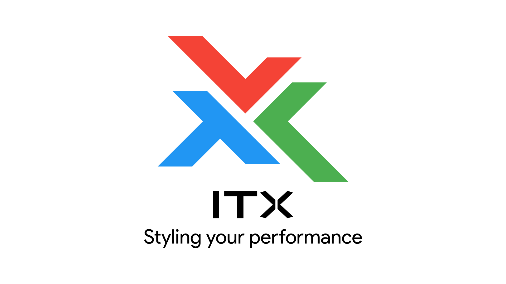

The red and the green parts of the logo also depict laptops - the roots of the company.

Finally, since the logo was divided into 3 parts, I chose the 3 primary colours of the digital world - Red, Green and Blue (in the same order) for the logo. However, I didn't go for pure colours as they would be overly contrasting.

I went with a geometric typeface for the name of the company to match with the style of the logo, however, the tagline uses a simple display font that will be used everywhere else.

### Envelope

Moving on, the next task at hand was designing the envelope. I tried to keep a minimal design with a priority on content. To fill the empty area, I used a photo of the company's laptop.

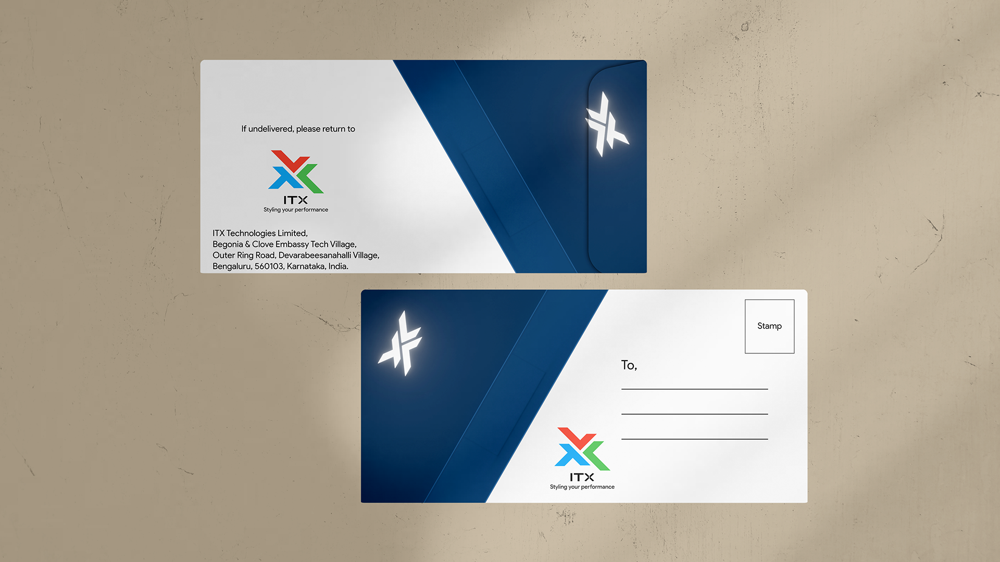

### Visiting card

To keep up with the same style as that of the envelope, I chose to use a laptop image even in visiting cards. The back of it is rather plain to show a visual distinction between the front and the rear side.

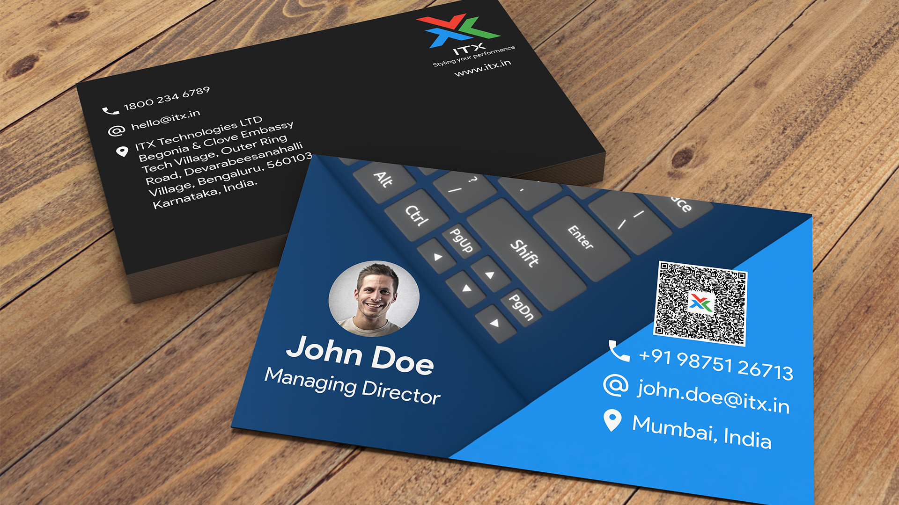

### Letterhead

The letterhead needed a rather formal and simple design. So, I had to drop the consistency with the envelope and the visiting cards. I chose to keep the 3 colours of the logo.

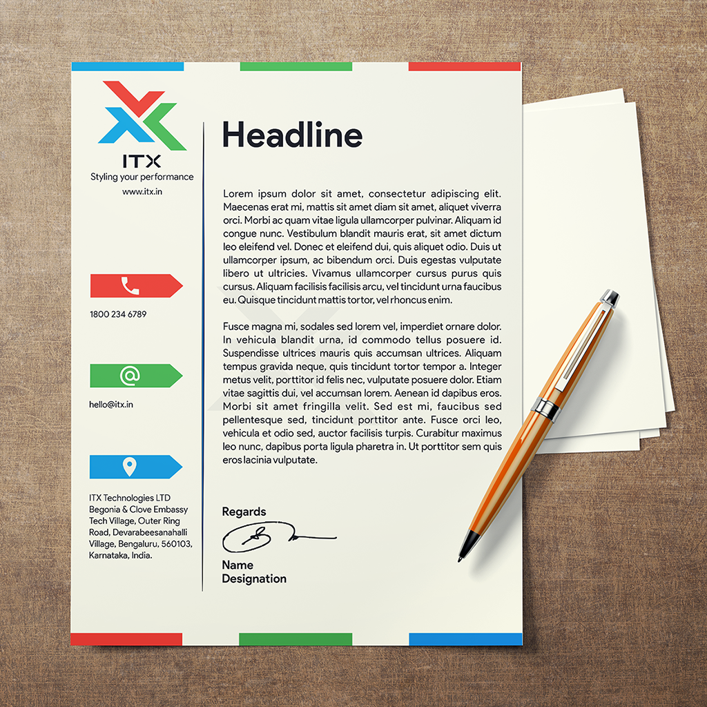

### Newspaper advertisements

The first two newspaper advertisements are full-page broadsheet advertisements while the third one is a full-page tabloid advertisement. All these advertisements follow the same logic, that is highlight one important feature of the laptop and mention other features as icons. Catchy headlines and graphics have been used to seek attention faster.

* The first advertisement is targeting the people looking for laptops with great design as well as great performance.

* The second advertisement is targeting people looking for speed as a primary factor.

* The third advertisement is targeting gamers and high-performance laptop seekers.

While the features are the same in all of them, the advertisements are made in different ways to attract different customers.



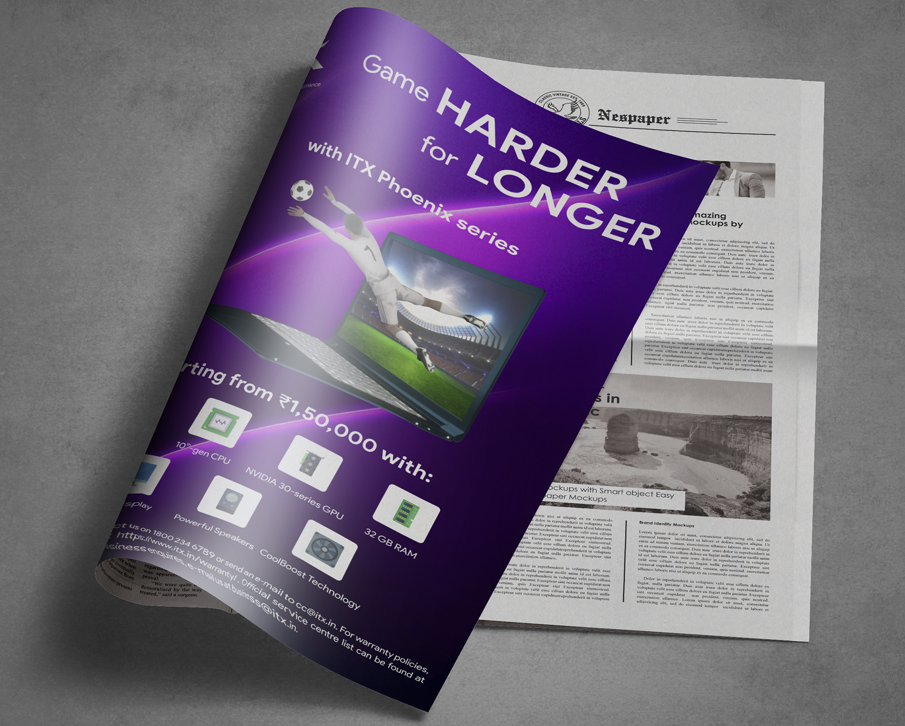

### Magazine advertisements

For magazine advertisements, things were not that simple. I checked some references and saw that these ads are highly creative and not so fond of words. So, it was a task to think of ideas along the same lines. All the advertisements are full-page advertisements.

* The concept of the first advertisement is as follows: The headline suggests that don't just keep praying. If you work, it means you worshipped. Thus, use our laptops and work instead of just praying for things to happen automatically.

* In the second advertisement, it is indirectly being said that other laptops are as good as a typewriter as compared to ITX's laptops. Also, to show the transition from old to new, the typewriter is shown in black and white while the laptop is in colour.

* In the third advertisement, the laptop is shown running multiple heavy tasks at the same time. Thus the headline.



### Out Of Home advertisements

OOH ads have been made to display on billboards at highways, etc.

* The first advertisement shows a girl on a camp using her laptop. Usually, laptops with low battery won't last, but, ITX's laptops have an all-day battery and so, people can even carry them on long travels without the worry to charge it.

* The second advertisement has a slightly complicated thought. It basically shows that nowadays, smartphones have got very powerful and people have started switching to those from laptops thinking it can handle it all. But, the fact is, no matter how powerful a contemporary phone is, it can't match laptop's power in productivity due to the scaled-down applications.



### Transit advertisement

Transit ad was a little more challenging than most of the other ads mainly because there has to be minimum text and the graphics should do the talking. Both the text and graphics should stand out in such a way that it not only captures the attention, it also activates the interest and desire for the product. So, this time I chose to exaggerate the lightness of the laptop by showing it perfectly fine on the tip of a finger.

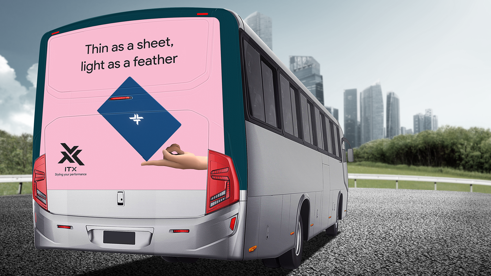

### Ambient advertisement

Ambient advertising pushed my thinking skills to a different level. Not only had I not seen many ambient advertisements in real life, but I also didn't even know what they were. So, I had to start from there. I tried looking online for references and to understand what ambient ads really are. I was surprised to see such creative use of open space to grab public attention. I then thought of integrating and displaying laptops in public areas. But it's not possible to just go and install laptops everywhere. Instead, I thought of places where people generally use laptops, like libraries, airports, coffee houses, etc. I then made chairs which would represent my laptop. So, anytime someone tries to sit, they'd be reminded of the laptop.

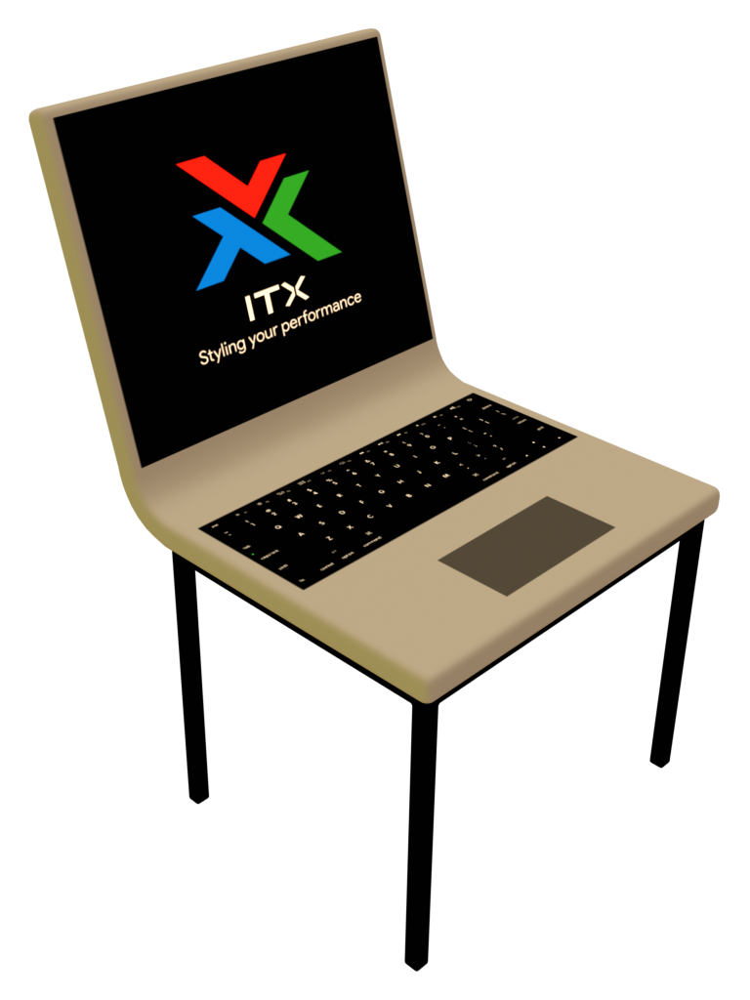

### Packaging design

The packaging is the last form of advertising a brand can do before the user actually uses and reviews the product. Thus, it's equally important for the brands to design excellent packaging too. I started off by designing a die sheet to get an overall idea of how the packaging would look. I decided on the dimensions, the positioning of flaps, etc.

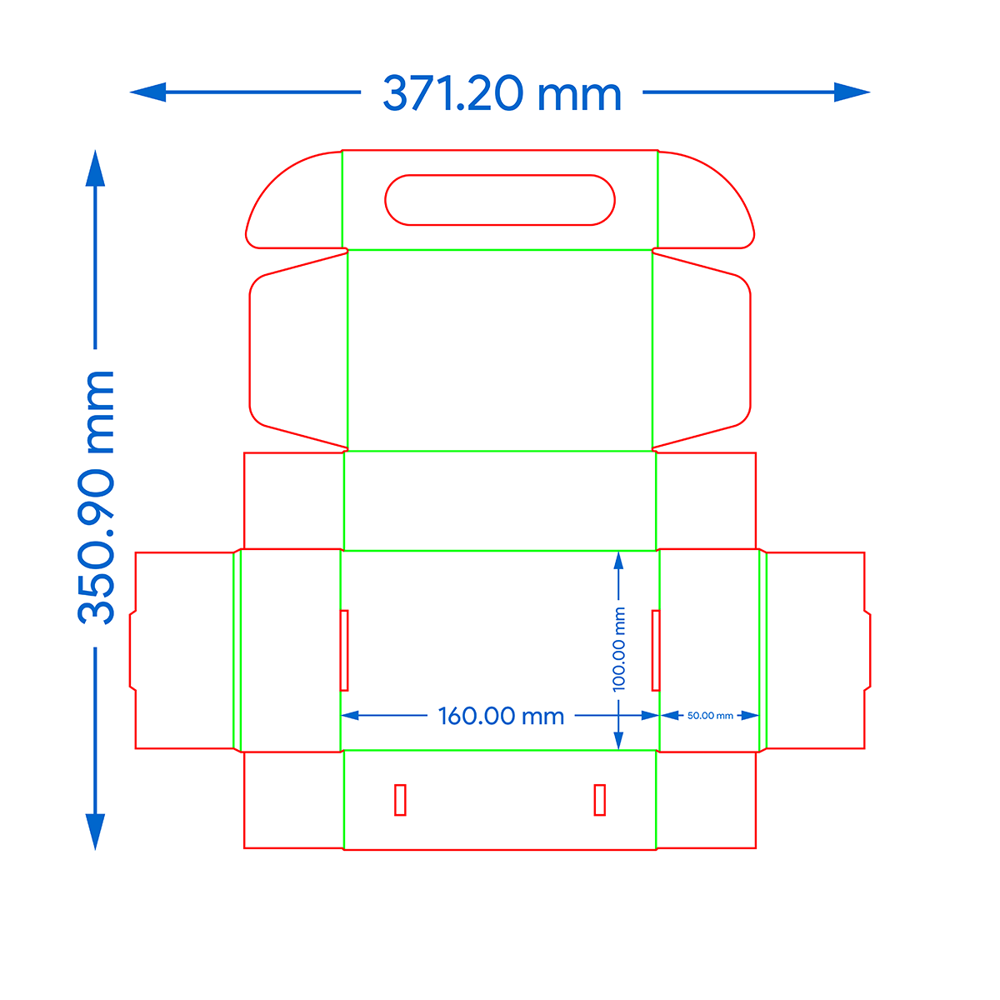

Once that was done, I moved on to 3D. I made a simple 3D layout of the die sheet (and excluded some not-so-important folds). Then, I folded the parts to make a box and added the design as a texture on it.

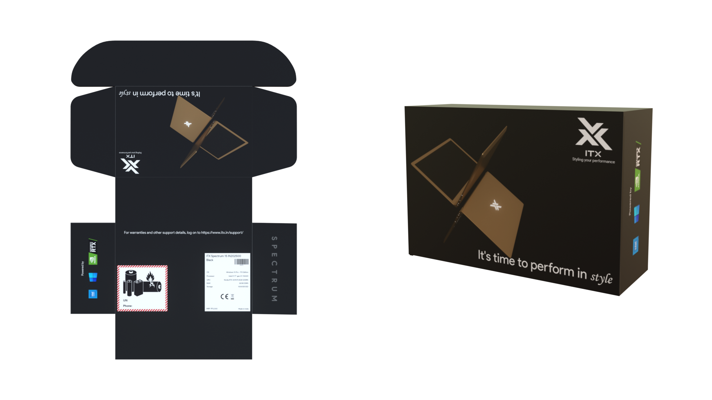

### Standees

Standees are an excellent form of point of purchase advertising. It just exists and does a great job at attracting potential nearby customers towards the product. For the standees, I chose a stylized look.

* The first standee shows that this laptop is lightweight and still cheap. Lightweight laptops are generally costly, but not this one.

* The second standee shows a monkey being able to use a laptop. Basically, ITX's laptops are so easy to use that even animals can use them.



### Dangler

Danglers are the smallest form of advertisement from this lot. There's nothing much to say in danglers. They serve the sole purpose of navigation the in-store potential buyers to the product. I chose to highlight an offer on the dangler. One side mentions the text and the other side shows the product image.

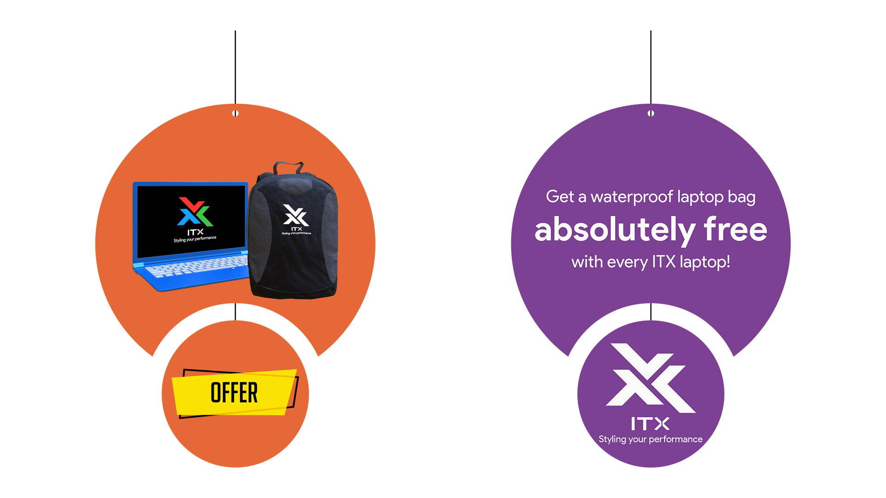

### Merchandise

A large number of people buy laptops for portability and to carry it, they need something safe enough. Thus, to sell merchandise, I decided to make a bag which can be officially made by the company to exactly fit and protect the company's laptops while the customer travels. Just like in danglers, the company can sell the merchandise as an offer or separately.

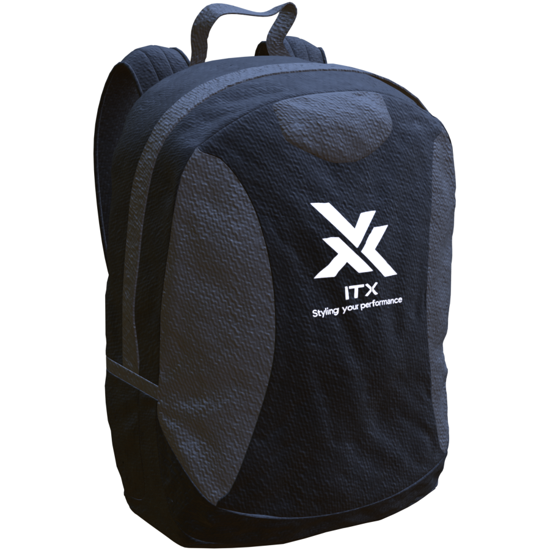

### Social Media advertisements

The next segment of the project required me to make social media advertisements. Since I'm not much of a social media user myself, I didn't know much about posting on social media (well, I still don't). I checked the social media posts of various companies to see what they do. Accordingly, I came up with short images. Each advertisement highlights one important feature of the laptop.

* On social media, everything looks glamourous, and so the laptops should look the same way too. Thus, the first advertisement highlights the available colour choices. Previously, laptops used to be simple black or grey coloured, but now the customers can get colour choices too.

* The second advertisement shows the speed of the laptop. It was already fast, but now with improved technology, it has gotten faster.

* The third advertisement shows that the customers don't need to stop working or playing when the laptop's battery goes off, usually in 5 to 6 hours as ITX's laptops batteries can last for 24 hours.

All these advertisements will have a set of hashtags that would promote the posts even more.



### Home Page layout

Just like the previous project, we had to make a home page for this project too. The page didn't have to be functional, just depict the layout. However, it couldn't just be an image either. Last time I made the websites in Tumult Hype, but since my simple HTML/CSS/JS skills had sharpened, this time I spent the time to code the website myself from scratch. I used UIkit as the bae library to style the website and added some dummy content. [Check out the website here](assets/website1/).

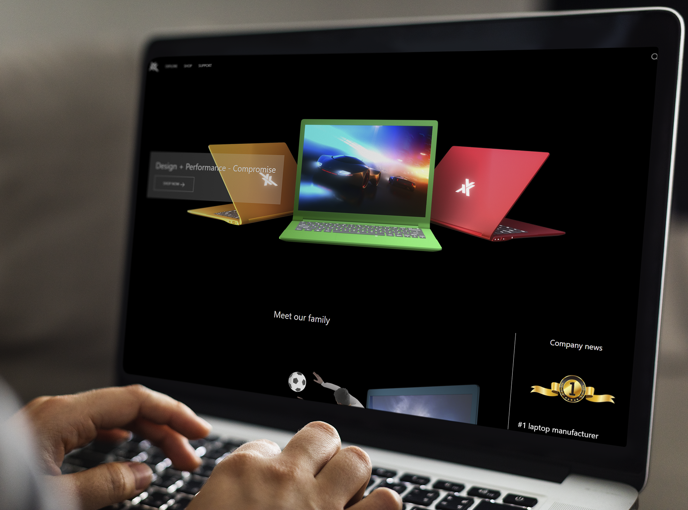

### Radio advertisement

A radio script is always a tricky job as we don't get to use several appeals that are related to the gift of sight. We can only rely on audio cues. Nevertheless, since it was a part of the project, I wrote a simple script, though it's longer than usual. I just didn't want it to be a simple problem-solution advertisement like most of the radio advertisements we hear. So, I tried to use a slightly different approach. I used TTS to record the advertisement.

Script:

>Character 1: Hey, our boss is asking for an update about our task through an e-mail, but my laptop is currently busy rendering the animation. Could you send the e-mail instead?
>
>Character 2: Well, my laptop is also busy doing the render, but yeah, it won’t be a problem.
>
>Character 1: Are you sure? The rendering should not be disturbed.
>
>Character 2: Yeah. Thanks to the ITX Spectrum laptop that I’m using, multitasking is no problem.
>
>Character 1: Oh really? But, I bet, the performance might be affected.
>
>Character 2: Nah, currently my laptop is rendering twice the number of frames than yours. So, you see, the performance is brilliant. At the same time, it’s also energy efficient. The battery lasts for more than 7 hours doing heavy tasks. Also, the design is absolutely premium, and the best part is that it is super lightweight which makes it great for portability.
>
>Character 1: Wow, but, all this might cost a lot!
>
>Character 2: Absolutely not! You can buy this amazing laptop starting from just ₹75,000 on the official website of ITX - www.itx.in. I always choose ITX for my technological needs.
>
>Character 1: Thanks a lot! I’ll buy it today.



### Television advertisement

Now we've come to the final part of the project, the television advertisement - the task that took me the maximum time (around 5 days). I had the 3D model ready as I've already used the same one in all other advertisements, but I had to think of what and how to show. I saw various laptop advertisements on YouTube. A lot of them included teardowns of the laptops to some extent, but that was beyond my skill level. So, I decided to show the externals only. Using various camera angles, I'd show the prominent features of the laptop. But, I couldn't directly jump into animation. I needed to make a storyboard. This wasn't by choice, we were asked to make at least a storyboard if not the entire video, but I went ahead and made both.



For the music, I searched online till I found something that suited. However, even this one wasn't a complete fit. I had to rework my video a bit to actually sync the music with it. But, here's the final video after editing and adding music:



## Challenges faced

The primary challenge was to finish the project on time. Since the college had started late, we had really got less time to finish this project and it wasn't just one. We had 5 more subjects to work on. Thus, managing time was getting difficult. I had to force myself to think of and execute at least one idea per day.

Moving on, there's still a slight point of regret in this project. While I'm satisfied for the most part, I still didn't like the fact that I got some weird artefacts in the television advertisement. For those who missed it, I'm talking about the stuff like shadows here:

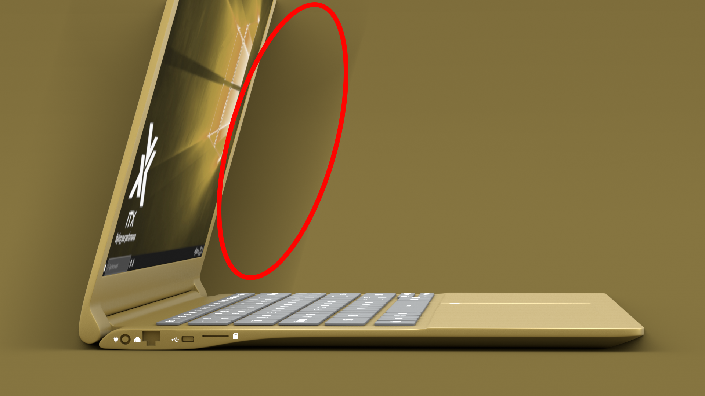

I don't even know if they're shadows or something else altogether and most people whom I showed the video, didn't even notice it. But, I can't un-see it. I'd indeed like to know what and how that's caused, so if someone knows about it, feel free to comment.

## Presenting the project

Since this was an online-only semester, the viva was also conducted online. While the viva went great, I am sure it would have been better for me to be actually able to present it physically rather than virtually. The connection problems, and constantly trying to make sure that the other person can hear us is just too much work.

## TL;DR

ITX is a fictional laptop manufacturing company. I made the entire advertising campaign in around a month. It was full of challenges and learning opportunities. However, as I mentioned above, I do have that one little regret. Apart from that, I personally feel that I've made some progress with my skills.